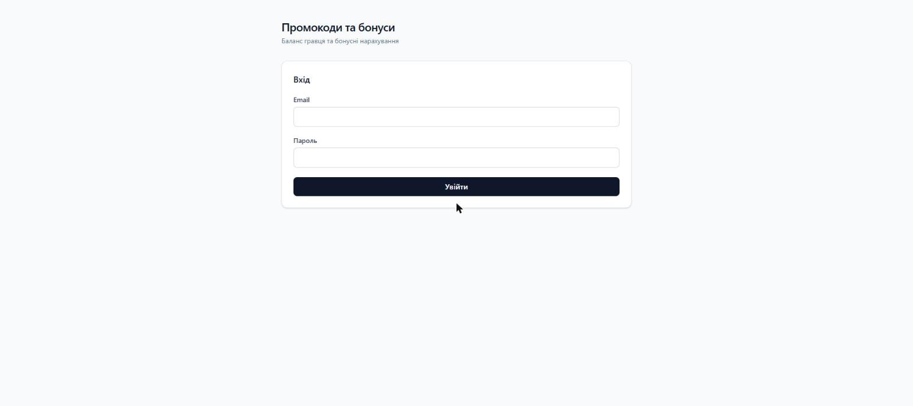
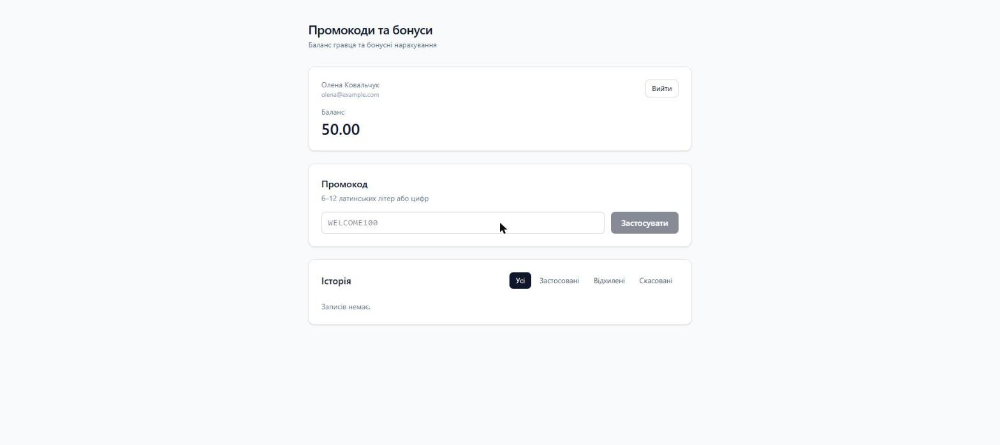
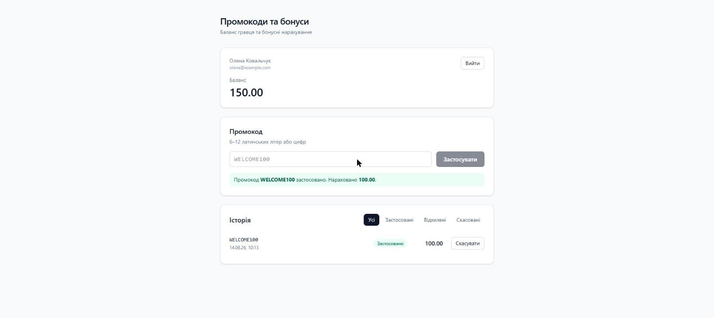
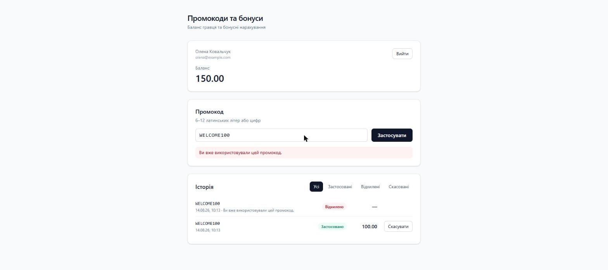
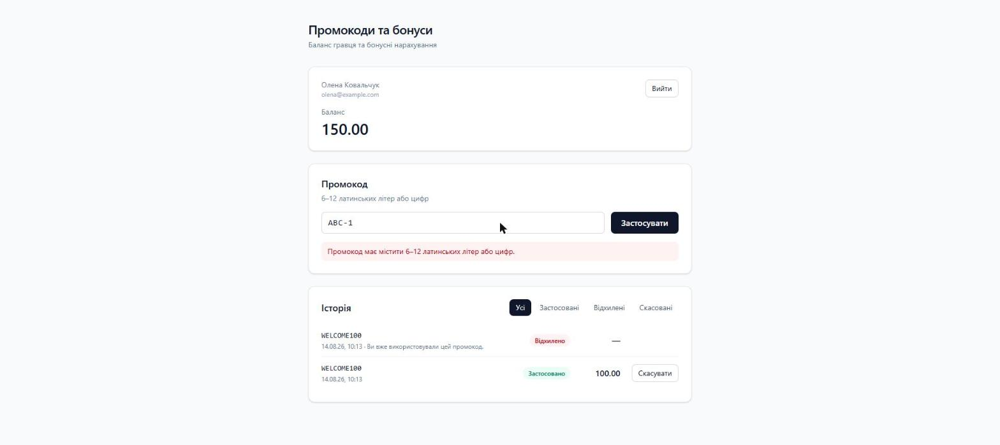
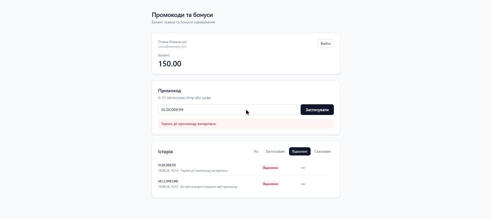
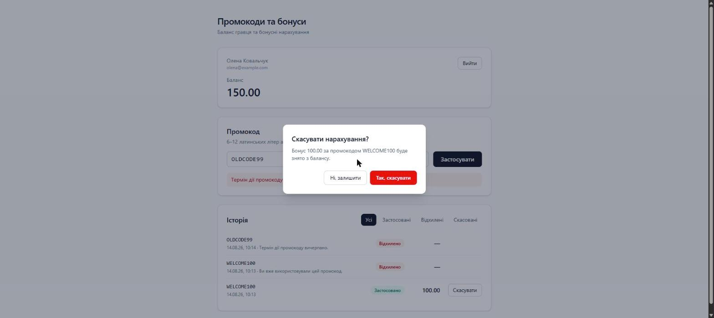
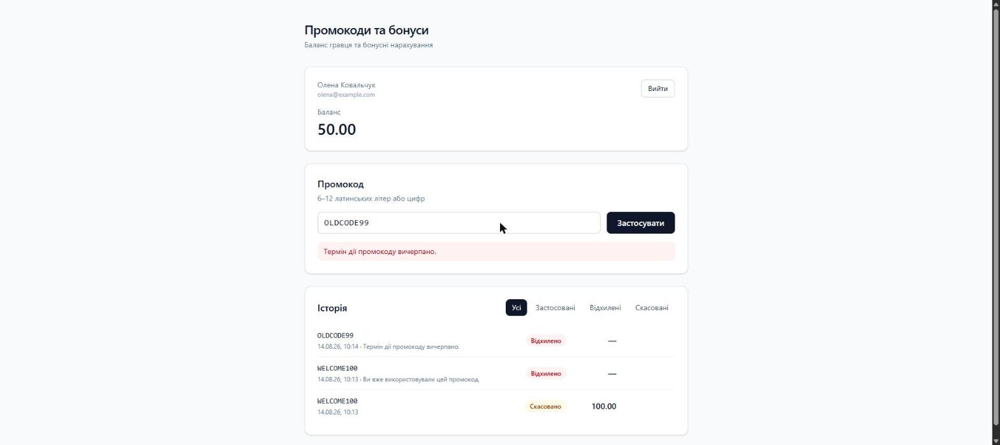
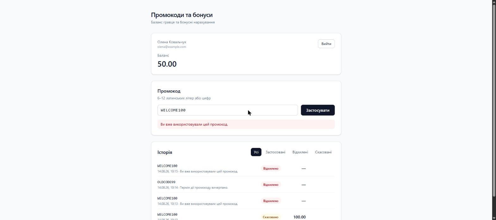

# Запуск і обидві фічі в скріншотах

Умова дозволяє відео **або послідовність скріншотів**. Це — послідовність: один прохід
по чистій БД (`php artisan migrate:fresh --seed`), від запуску до обох фіч.
Знімки зроблені в Chrome на `http://127.0.0.1:8000/`, без монтажу й без правок.

Сценарій для відео, якщо записуватимемо його додатково, — [`DEMO-SCRIPT.md`](DEMO-SCRIPT.md).

## 0. Запуск

```
$ php artisan migrate:fresh --seed
  INFO  Seeding database.
  Database\Seeders\PromoCodeSeeder .. 20 ms DONE

$ php artisan serve --port=8000
  INFO  Server running on [http://127.0.0.1:8000].

$ npm run dev
  VITE v8.2.1  ready in 763 ms
  ➜  Local:   http://localhost:5173/
  LARAVEL v13.25.0  plugin v3.2.0
  ➜  APP_URL: http://localhost:8000
```

Тести з обох боків:

```
$ php artisan test
  Tests: 52 passed (205 assertions)

$ npm test
  Test Files  5 passed (5)
       Tests  36 passed (36)

$ php vendor/bin/pint --test
  PASS
```

## 1. Форма логіну



Проєкт піднято, фронтенд віддається через Vite. Реєстрації немає — вона поза скоупом,
гравці засіяні (`olena@example.com` / `ihor@example.com`, пароль `password`).

## 2. Увійшли: баланс і порожня історія



Баланс **50.00**, історія порожня. Гравець визначається з токена — жоден ендпоінт
не приймає його ідентифікатор з тіла запиту чи URL.

## 3. Тікет 1: бонус нараховано



`WELCOME100` → баланс **50.00 → 150.00**, повідомлення про суму, у списку з'явився рядок
зі статусом «Застосовано». Баланс і сума прийшли у відповіді на claim — окремого запиту
за балансом не робимо.

## 4. Повторне застосування того самого коду



**Ключовий кадр.** Баланс лишився 150.00 — подвійного нарахування немає. Захист тримається
не на `if`, а на **частковому unique-індексі** `(user_id, promo_code_id) WHERE status <> 'rejected'`,
тож дві одночасні спроби теж не пройдуть: друга падає на індексі.

Тут же видно другу вимогу умови: **відхилена спроба записана в історію** з причиною.
Інакше фільтру «відхилено» не було б за чим фільтрувати.

## 5. Помилка формату — 422, і вона нічого не пише в історію



`ABC-1` не проходить формат `^[A-Za-z0-9]{6,12}$` → **422**. В історії як було два рядки,
так і лишилось: до домену запит не дійшов, писати не було чого.

Це різні коди для різних речей: **422 — формат**, **409 — бізнес-правило** (з машинним
`reason` у тілі).

## 6. Прострочений код і фільтр за статусом



`OLDCODE99` → «Термін дії промокоду вичерпано» (409, `reason: expired`). Фільтр «Відхилені»
показує обидві невдалі спроби з їхніми причинами. Пагінація — по 5 рядків, фільтр
зберігається в посиланнях сторінок.

## 7. Тікет 2: підтвердження скасування



Кнопка «Скасувати» стоїть лише напроти застосованих нарахувань — за полем `can_revoke`
з API, а не за правилом, продубльованим на фронті.

Модалка **власна, не `window.confirm`**: у ній видно суму й код, вона закривається Escape
і кліком по підкладці, а під час запиту закриття заблоковане.

## 8. Скасовано



Баланс **150.00 → 50.00**, статус «Скасовано», кнопка зникла. Списання пішло окремою
**від'ємною проводкою** в `wallet_transactions` — сума проводок гравця завжди сходиться
з його балансом.

Повторне скасування неможливе: unique `(promo_claim_id, type)` на ledger не дасть вставити
друге списання навіть при гонці, і клієнт отримає 409 `already_revoked`.

## 9. Скасування не звільняє промокод



`WELCOME100` після скасування — знову «вже використовували», баланс 50.00. Це свідоме
рішення: якби `revoked` звільняв код, цикл claim → revoke → claim друкував би гроші.

## 10. Гравці ізольовані


Вхід як `ihor@example.com`: свій баланс **125.50**, історія порожня, той самий `WELCOME100`
йому доступний. Історія й баланс ніде не перетинаються.

---

**Не показано в цій послідовності** (перевірено тестами, `PromoRevokeTest`):
скасування при нестачі балансу → 409 `insufficient_balance`, баланс у мінус не йде і статус
не змінюється; чужий `claimId` → **404**, а не 403, щоб не підтверджувати існування
чужих записів.
